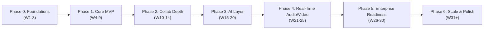
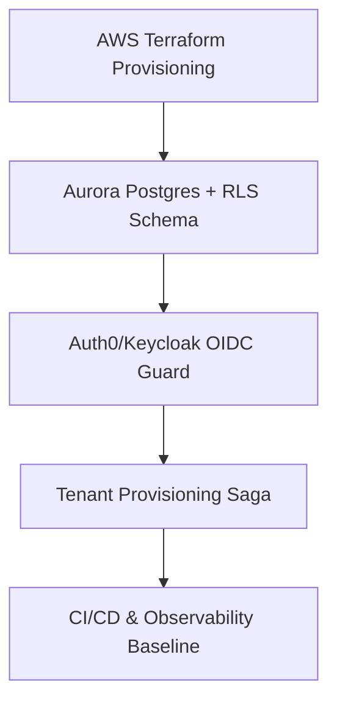
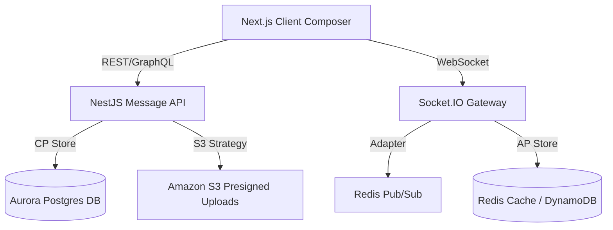
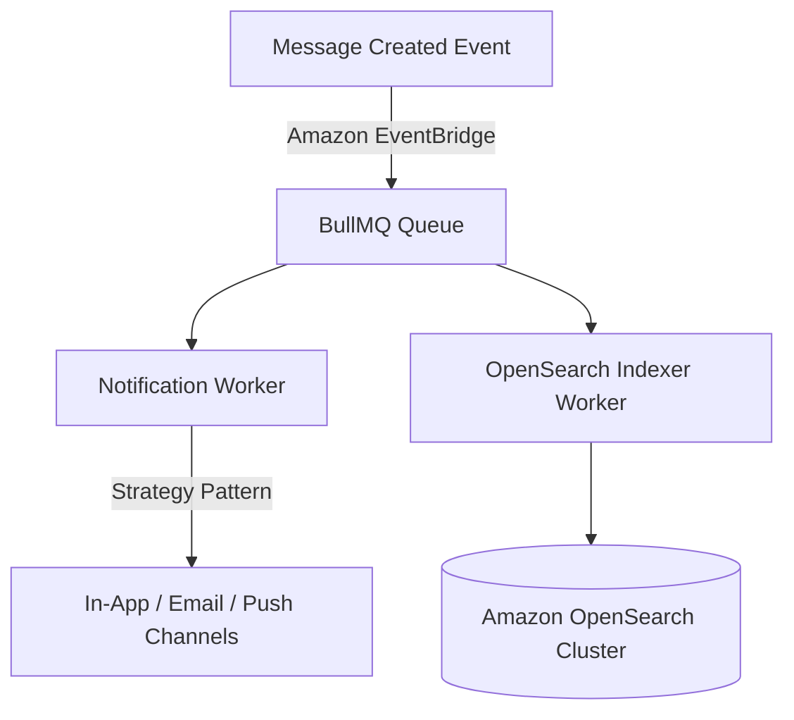
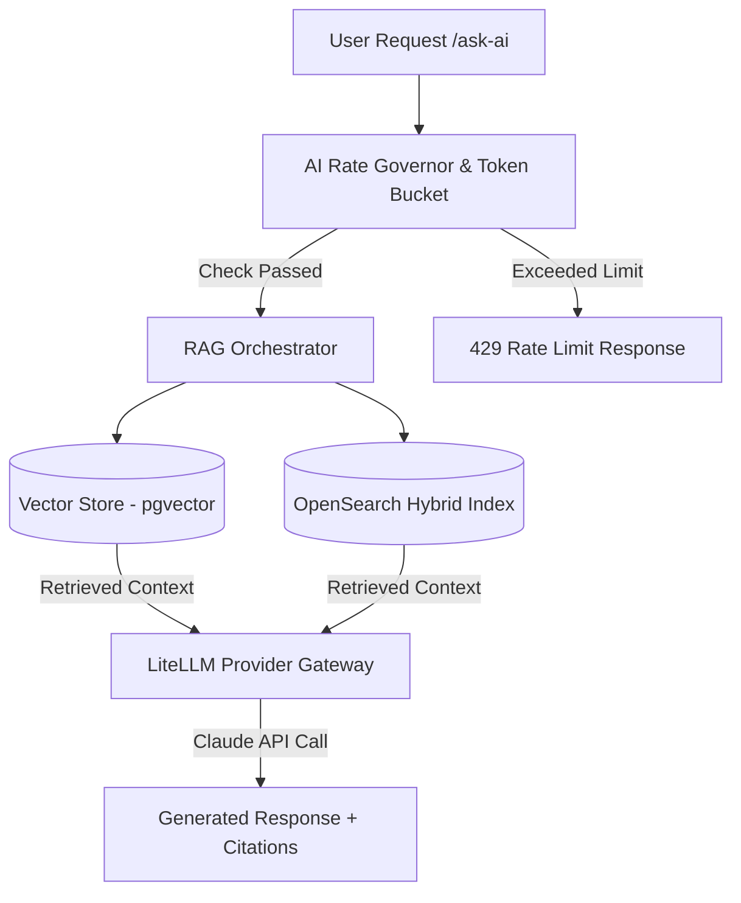
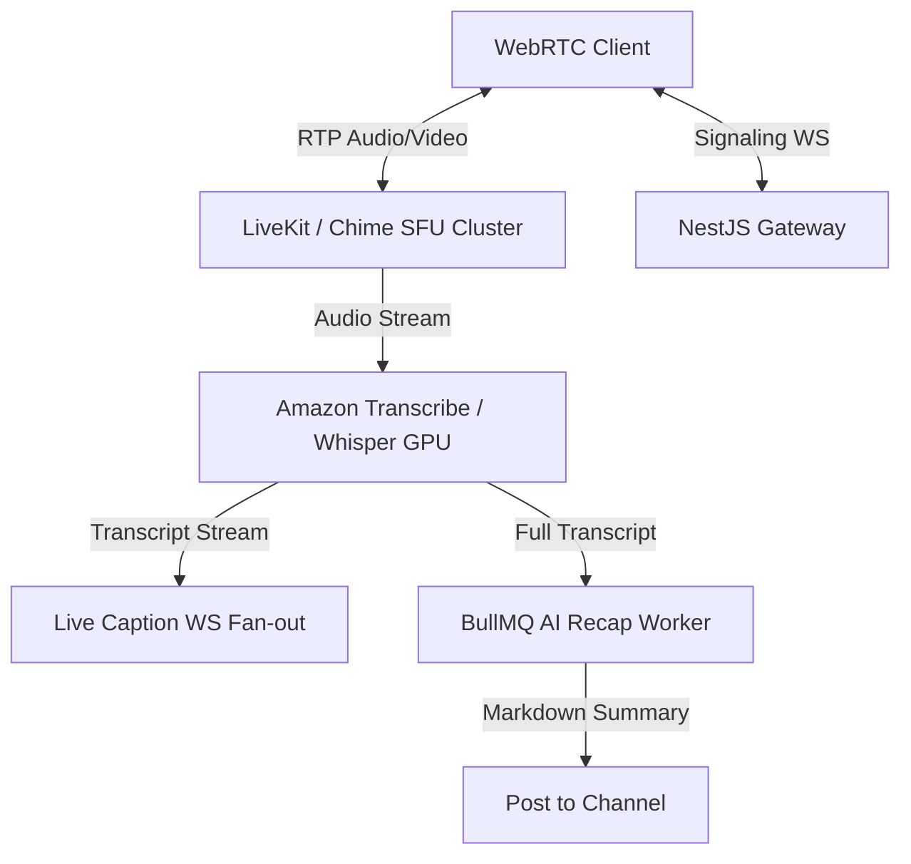
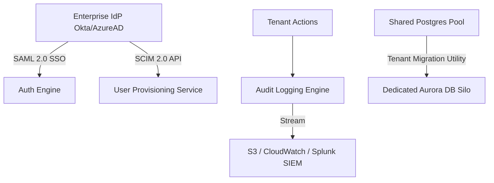
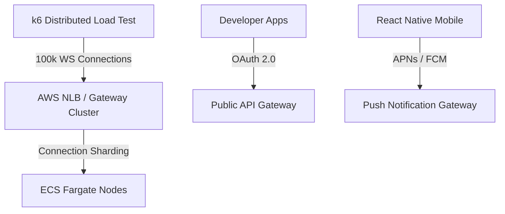

# NexusHub — Implementation Action Plan & Engineering Roadmap

> **Authoritative Implementation Guide**  
> This action plan translates the [Nexus Workspace Specification](file:///d:/NexusHub/docs/nexus-workspace-spec.md) and [Nexus Engineering Guidelines](file:///d:/NexusHub/docs/nexus-engineering-guidelines.md) into an actionable, phased execution roadmap. Every phase defines detailed tasks, subtasks, entry/exit criteria, CAP trade-off alignment, SOLID architecture checks, and final outcomes.

---

## Executive Summary & Governance Model

NexusHub is built on a **hybrid SDLC + Agile model**:
- **Traditional SDLC Phase Gates** govern architectural milestones, security compliance, tenant isolation, and release readiness.
- **Agile Sprints (2-Week)** execute granular user stories within each phase, guided by explicit **Definition of Ready (DoR)** and **Definition of Done (DoD)**.



### Architectural Guardrails Across All Phases

| Area | Mandate & Standard | Enforcement Mechanism |
|---|---|---|
| **Multi-Tenancy** | `workspace_id` scoping on all data structures + Row-Level Security (RLS) at DB layer. | CI/CD automated cross-tenant leak test suite. |
| **Real-Time Latency** | Message delivery p95 < 200ms within region. | k6 load tests & OpenTelemetry tracing. |
| **CAP Alignment** | Synchronous message path relies ONLY on CP stores (Postgres). AP stores (Redis, OpenSearch, Vector, DynamoDB) MUST NOT block message send. | Code review & architecture gate sign-off. |
| **SOLID Principles** | Strict separation of concerns (e.g. `MessageService` separate from `AISummarizationService`). | Merge-blocking code review checklist. |
| **ADR Governance** | Architectural decisions with long-term lock-in require an ADR in `/docs/adr/NNNN-title.md`. | Mandatory before phase gate exit. |
| **Non-Negotiables** | Zero hardcoded secrets, mandatory rate-limiting/cost governors for AI, complete observability tracing. | Automated scanner & DoD checklist. |

---

## Definition of Ready (DoR) & Definition of Done (DoD)

### Definition of Ready (DoR) for Phase Tasks
Before any task inside a phase moves to active execution:
- [ ] User story and acceptance criteria explicitly defined.
- [ ] Tenant boundary impact identified and `workspace_id` enforcement point designed.
- [ ] Schema / API contracts (OpenAPI/gRPC/GraphQL) defined and documented.
- [ ] CAP trade-off explicitly stated for any new data store or caching strategy.
- [ ] System design / ADR reviewed if touching core gateway, auth, billing, or multi-tenancy.

### Definition of Done (DoD) for Phase Tasks
A task or user story is considered **Done** only when:
- [ ] Business logic implemented following SOLID principles (SRP, OCP, LSP, ISP, DIP).
- [ ] Postgres RLS policies implemented and verified with automated cross-tenant isolation tests.
- [ ] Unit tests and integration tests written and passing (coverage thresholds met).
- [ ] Code reviewed and approved against engineering guidelines checklist.
- [ ] Feature flag wrapped with explicit rollback plan documented.
- [ ] Observability hooks integrated (structured logging, metrics, OpenTelemetry spans).
- [ ] Public/Internal API documentation updated.

---

# Detailed Phased Implementation Roadmap

---

## Phase 0: Foundations & Architecture Baseline (Weeks 1–3)

### Phase Overview
Establish the cloud infrastructure baseline, automated CI/CD pipelines, identity authentication provider, multi-tenant database schema with Row-Level Security (RLS), tenant provisioning saga, and baseline observability stack.



### Entry Criteria
- [ ] Project repository initialized and team code owner permissions configured.
- [ ] AWS Organization accounts created (`dev`, `staging`, `prod`) with billing alarms active.
- [ ] Architectural guidelines (`nexus-engineering-guidelines.md`) and specification (`nexus-workspace-spec.md`) reviewed and signed off by tech lead.

---

### Detailed Task Breakdown

#### Task 0.1: Cloud Infrastructure Baseline (IaC via Terraform)
- **Subtask 0.1.1**: Author Terraform modules for multi-AZ VPC, public/private/isolated subnets, Internet Gateways, NAT Gateways, Security Groups, and IAM Roles across AWS accounts (`dev`, `staging`, `prod`).
- **Subtask 0.1.2**: Setup AWS Secrets Manager and SSM Parameter Store for secure application key management.
- **Subtask 0.1.3**: Configure KMS keys for envelope encryption of tenant data at rest.
- **Guideline Alignment**: Non-negotiable #6 (No secrets in code, KMS encryption at rest).

#### Task 0.2: Multi-Tenant Database Architecture & Row-Level Security (RLS)
- **Subtask 0.2.1**: Provision Supabase PostgreSQL project baseline & connection pooling module (Multi-AZ / High Availability) with automated backups.

- **Subtask 0.2.2**: Implement base schema migrations (Prisma/TypeORM/Drizzle): `tenants`, `workspaces`, `users`, `workspace_memberships`.
- **Subtask 0.2.3**: Enable Postgres Row Level Security (RLS) on all tenant-scoped tables:
  ```sql
  ALTER TABLE workspace_memberships ENABLE ROW LEVEL SECURITY;
  CREATE POLICY tenant_isolation_policy ON workspace_memberships
    USING (workspace_id = current_setting('app.current_workspace_id')::uuid);
  ```
- **Subtask 0.2.4**: Write automated integration tests that fuzz `workspace_id` parameters to verify zero cross-tenant data leakage.
- **Subtask 0.2.5**: Publish `ADR-0001: Multi-Tenancy Architecture & Row-Level Security Strategy`.
- **Guideline Alignment**: Section 2 (Tenant Boundaries), Section 9 (Non-Negotiable #1 — RLS mandatory).

#### Task 0.3: Identity, Auth Guard & Tenant Provisioning Saga
- **Subtask 0.3.1**: Configure Auth0 / Keycloak OIDC authentication tenant domain mapping.
- **Subtask 0.3.2**: Build NestJS `AuthGuard` and `TenantInterceptor` to extract JWT claims, validate workspace access, and execute `SET LOCAL app.current_workspace_id` on DB connection pool checkout.
- **Subtask 0.3.3**: Implement Tenant Provisioning Saga (`TenantProvisioningService`):
  1. Insert workspace record into DB.
  2. Create default channels (`#general`, `#random`).
  3. Assign creator as `WorkspaceAdmin`.
  4. Trigger compensating rollback actions on step failure.
- **Guideline Alignment**: Section 5 (SOLID - SRP), Section 8 (Saga Pattern for Tenant Provisioning).

#### Task 0.4: CI/CD Pipeline & DevSecOps Skeleton
- **Subtask 0.4.1**: Build GitHub Actions pipeline: Linting (ESLint), Type Checking (`tsc`), Unit Testing (`vitest`), and Dependency Vulnerability Scanning (Snyk/Trivy).
- **Subtask 0.4.2**: Configure AWS ECR image build pipeline and AWS ECS Fargate blue/green deployment triggers via AWS CodeDeploy.

#### Task 0.5: Observability Baseline
- **Subtask 0.5.1**: Instrument NestJS backend and Next.js frontend with OpenTelemetry SDK.
- **Subtask 0.5.2**: Route logs to AWS CloudWatch Logs, error tracking to Sentry, and metrics to Datadog/Grafana.

---

### Exit Criteria & Phase Gate Deliverables
- [ ] AWS infrastructure deployed via 100% reproducible Terraform scripts.
- [ ] Postgres RLS policies active and **100% pass rate** on cross-tenant data leak automated test suite.
- [ ] Tenant Provisioning Saga successfully creates a tenant, default channels, and admin user with failure compensation tested.
- [ ] CI/CD pipeline executes under 10 minutes with green security scan status.
- [ ] Signed-off `ADR-0001` stored in repository.

### Final Outcomes
Fully provisioned cloud baseline, secure multi-tenant database foundation with DB-enforced RLS, identity auth guards, automated deployment pipeline, and observability telemetry.

---

## Phase 1: Core Messaging MVP (Weeks 4–9)

### Phase Overview
Deliver a high-performance, real-time Slack-parity core messaging application including workspaces, public/private channels, 1:1 and group DMs, threaded conversations, emoji reactions, S3 file uploads, presence, typing indicators, and Postgres full-text search.



### Entry Criteria
- [ ] Phase 0 Exit Criteria fully verified and signed off.
- [ ] Real-time gateway architecture & API contracts defined.
- [ ] Published `ADR-0002: Real-time WebSocket Gateway & Redis Pub/Sub Scaling Strategy`.

---

### Detailed Task Breakdown

#### Task 1.1: Core Domain Entities & Service Layer (SOLID Architecture)
- **Subtask 1.1.1**: Design domain models and Postgres tables: `channels`, `channel_members`, `messages`, `threads`, `reactions`, `attachments`.
- **Subtask 1.1.2**: Implement `MessageService` adhering strictly to Single Responsibility Principle (SRP) — handles message CRUD only; no notification or AI logic attached.
- **Subtask 1.1.3**: Implement REST and GraphQL APIs for workspace setup, channel creation, and member invitation.
- **Guideline Alignment**: Section 5 (SOLID - SRP), Section 9 (Non-Negotiable #2 — No god services).

#### Task 1.2: Real-Time WebSocket Gateway Infrastructure
- **Subtask 1.2.1**: Implement NestJS Socket.IO gateway service deployed on ECS Fargate behind AWS Application Load Balancer (ALB).
- **Subtask 1.2.2**: Integrate `@socket.io/redis-adapter` backed by AWS ElastiCache Redis for horizontal cross-node WS message fan-out.
- **Subtask 1.2.3**: Enforce tenant & channel authorization during WS handshake and room joins (Rooms named: `workspace_{wsId}:channel_{chId}`).
- **Subtask 1.2.4**: Implement dynamic client heartbeat, automatic reconnection, and message gap synchronization.
- **Guideline Alignment**: Section 4 (HLD Sync vs Async), Section 6 (CAP Theorem — Redis as AP for WS pub/sub).

#### Task 1.3: Real-Time Message Flow & Critical Path Optimization
- **Subtask 1.3.1**: Implement high-speed message pipeline:
  `Client Send -> WS Gateway -> Auth/Tenant Check -> Postgres Transaction -> Redis Pub/Sub -> WS Fan-out`.
- **Subtask 1.3.2**: Benchmark critical path to guarantee **p95 delivery latency < 150ms** under 5,000 concurrent active connections.
- **Subtask 1.3.3**: Implement threaded message replies (`parent_message_id`) and message edit/delete with immutable audit trail.
- **Guideline Alignment**: Section 6 (CAP Theorem — CP Postgres system of record; AP components must not block send path), Section 9 (Non-Negotiable #4).

#### Task 1.4: Ephemeral State Services (Presence & Typing Indicators)
- **Subtask 1.4.1**: Build `PresenceService` using Redis Key-Value pairs (`workspace:{ws_id}:user:{user_id}:presence`) with 5-second automatic TTL expiration.
- **Subtask 1.4.2**: Implement `TypingIndicatorService` broadcasting typing events via Redis Pub/Sub without persisting to Postgres.
- **Subtask 1.4.3**: Integrate DynamoDB for persistent presence heartbeat analytics (AP data store choice).
- **Guideline Alignment**: Section 6 (CAP Choice: Redis & DynamoDB as AP stores for ephemeral data).

#### Task 1.5: File & Media Handling (S3 Storage Strategy)
- **Subtask 1.5.1**: Build `StorageService` using **Strategy / Adapter Pattern** (`StorageAdapter` interface, `S3StorageAdapter` implementation).
- **Subtask 1.5.2**: Implement presigned URL upload endpoint with MIME type validation, file size limits, and virus scanning hooks.
- **Subtask 1.5.3**: Build async thumbnail and preview generator queue using BullMQ and S3 triggers.
- **Guideline Alignment**: Section 8 (Design Pattern: Strategy/Adapter Pattern for storage).

#### Task 1.6: Base Search (Postgres Full-Text Search)
- **Subtask 1.6.1**: Implement Postgres `tsvector` column and `GIN` indexes on `messages.content` scoped by `workspace_id`.
- **Subtask 1.6.2**: Build basic search query API supporting keyword matching, channel filtering, and sender filtering.

---

### Exit Criteria & Phase Gate Deliverables
- [ ] Real-time message delivery p95 latency **< 150ms** under 5,000 concurrent connection load tests.
- [ ] Zero cross-tenant data access across REST, GraphQL, and WebSocket room subscriptions.
- [ ] Automated unit and integration test coverage **>= 85%** across core messaging domain services.
- [ ] Storage strategy unit-tested with S3 presigned URL generation and file validation.
- [ ] Signed-off `ADR-0002` in `/docs/adr/`.

### Final Outcomes
Production-ready core Slack-parity web client (Next.js 15) and backend API (NestJS) supporting real-time channels, DMs, threads, reactions, file attachments, presence, typing indicators, and basic search.

---

## Phase 2: Collaboration Depth & Integrations (Weeks 10–14)

### Phase Overview
Expand collaboration features by adding granular RBAC, guest access, user groups, an event-driven multi-channel notification engine, OpenSearch migration for scalable message discovery, slash commands, external webhooks, and Workflow Builder v1.



### Entry Criteria
- [ ] Phase 1 Core MVP complete with stable messaging metrics.
- [ ] OpenSearch cluster architectural design and tenancy strategy approved.
- [ ] Published `ADR-0003: Amazon OpenSearch Multi-Tenant Indexing Strategy`.

---

### Detailed Task Breakdown

#### Task 2.1: Granular Role-Based Access Control (RBAC) & Guest Controls
- **Subtask 2.1.1**: Expand permission matrix: `WorkspaceAdmin`, `ChannelAdmin`, `Member`, `Guest` (Single-channel and Multi-channel guests).
- **Subtask 2.1.2**: Implement NestJS `@Roles()` decorator and `PermissionsGuard` checking granular scopes on protected endpoints.
- **Subtask 2.1.3**: Build User Groups module (`@engineering`, `@product`) enabling bulk channel invites and group `@mentions`.
- **Guideline Alignment**: Section 5 (SOLID - Interface Segregation Principle).

#### Task 2.2: Event-Driven Multi-Channel Notification Engine
- **Subtask 2.2.1**: Implement `NotificationService` adhering to **Open/Closed Principle (OCP)** using `NotificationChannel` interface (`InAppChannel`, `EmailSESChannel`, `PushNotificationChannel`).
- **Subtask 2.2.2**: Implement domain event listener (`message.created`, `user.mentioned`) producing notification jobs to BullMQ Redis queues.
- **Subtask 2.2.3**: Build per-user notification preference evaluator checking channel mutes, keyword triggers, and Do-Not-Disturb (DND) schedules.
- **Guideline Alignment**: Section 5 (SOLID - OCP), Section 8 (Design Pattern: Event-driven / Pub-Sub).

#### Task 2.3: OpenSearch High-Performance Search Indexing
- **Subtask 2.3.1**: Provision Amazon OpenSearch Service cluster with index templates namespaced by tenant (`workspace_{ws_id}_messages`).
- **Subtask 2.3.2**: Build async indexer worker reading from BullMQ queue to sync Postgres writes to OpenSearch.
- **Subtask 2.3.3**: Implement OpenSearch search service API supporting fuzzy search, highlight snippets, channel filters, date ranges, and file type filters.
- **Subtask 2.3.4**: Document explicit CAP trade-off: OpenSearch is eventually consistent (AP); indexing failures must NOT rollback core message sends.
- **Guideline Alignment**: Section 6 (CAP Choice: OpenSearch as AP), Section 9 (Non-Negotiable #4).

#### Task 2.4: Integrations Gateway & Workflow Builder v1
- **Subtask 2.4.1**: Implement Inbound Webhooks (post to channel via HTTP JSON POST) and Outbound Webhooks (event delivery with HMAC SHA256 signatures).
- **Subtask 2.4.2**: Implement Slash Commands engine (`/topic`, `/remind`, `/invite`) routing commands to registered handler strategies.
- **Subtask 2.4.3**: Build Workflow Builder v1 engine using Saga / State Machine pattern:
  - Trigger: `channel_join`, `reaction_added`, `webhook_received`.
  - Action: `send_message`, `create_task`, `send_email`.
- **Guideline Alignment**: Section 8 (Design Pattern: Strategy for slash commands, Saga for workflow triggers).

---

### Exit Criteria & Phase Gate Deliverables
- [ ] OpenSearch query p95 latency **< 250ms** across an index of 1,000,000 messages.
- [ ] Multi-channel notification engine delivers notifications with **> 99.9% reliability**.
- [ ] RBAC security audit clean with unit test coverage for guest access boundaries.
- [ ] Signed-off `ADR-0003` in `/docs/adr/`.

### Final Outcomes
Granular access control framework, event-driven notification engine across email/push/in-app, scalable OpenSearch infrastructure, webhook ecosystem, and Workflow Builder v1.

---

## Phase 3: Embedded AI Layer & Governance (Weeks 15–20)

### Phase Overview
Integrate native AI capability into NexusHub: RAG-based semantic natural language search, vector store integration (pgvector/Pinecone), channel/thread summarization ("catch me up"), agentic `/ask-ai` command with citations, AI composer assistant, and a critical tenant AI cost governor with administrative usage dashboards.



### Entry Criteria
- [ ] Phase 2 complete.
- [ ] AI model integration architecture approved with tenant privacy review.
- [ ] Published `ADR-0004: Model-Agnostic LLM Gateway & Vector Database Selection`.

---

### Detailed Task Breakdown

#### Task 3.1: Model-Agnostic LLM Gateway & Vector Embedding Ingestion
- **Subtask 3.1.1**: Build `LLMGatewayService` adhering to **Liskov Substitution Principle (LSP)** using `LLMProvider` interface (implementing Claude API, OpenAI, and self-hosted fallback via LiteLLM).
- **Subtask 3.1.2**: Provision vector store (pgvector extension on Aurora Postgres or Pinecone cluster) with tenant vector namespacing (`workspace_{ws_id}`).
- **Subtask 3.1.3**: Build asynchronous embedding pipeline:
  `Message/Attachment Created -> Text Chunking -> Voyage/OpenAI Embeddings -> Vector Store Indexing via BullMQ`.
- **Guideline Alignment**: Section 5 (SOLID - LSP), Section 6 (CAP Choice: Vector Store as AP).

#### Task 3.2: RAG Hybrid Search & Agentic `/ask-ai` Service
- **Subtask 3.2.1**: Build Hybrid Retrieval Pipeline: Combine OpenSearch keyword score + Vector semantic similarity score using Reciprocal Rank Fusion (RRF).
- **Subtask 3.2.2**: Implement `/ask-ai` Slash Command using Claude Agent SDK tool-calling framework:
  1. Parse query intent.
  2. Perform tenant-scoped hybrid retrieval.
  3. Construct prompt with retrieved message context.
  4. Stream response to client with exact markdown citations linking to source messages.
- **Guideline Alignment**: Section 9 (Non-Negotiable #1 — Vector queries strictly scoped by `workspace_id`).

#### Task 3.3: AI Thread & Channel Summarizer ("Catch Me Up")
- **Subtask 3.3.1**: Build `AISummarizationService` (separate from `MessageService` per SRP).
- **Subtask 3.3.2**: Create async API endpoint calculating unread messages for a user in a channel, generating structured markdown summaries (Key Topics, Decisions Made, Action Items).
- **Subtask 3.3.3**: Integrate UI "Catch Me Up" button in channel header and thread view.
- **Guideline Alignment**: Section 5 (SOLID - SRP: Summarization separate from message CRUD).

#### Task 3.4: AI Compose Assistant
- **Subtask 3.4.1**: Build inline editor assistant providing real-time text rephrasing, tone adjustment (formal, casual, concise), grammar correction, and multi-language translation.

#### Task 3.5: Tenant AI Cost Governor & Usage Dashboard
- **Subtask 3.5.1**: Implement **Token Bucket & Circuit Breaker Pattern** (`AICostGovernorService`) tracking per-tenant token usage and API spending.
- **Subtask 3.5.2**: Enforce strict rate limits and daily budget caps per workspace; return 429 when budget limit is reached without affecting core messaging.
- **Subtask 3.5.3**: Build Workspace Admin AI Usage Dashboard displaying token usage breakdown, cost per feature, and budget control toggles.
- **Guideline Alignment**: Section 8 (Design Pattern: Circuit Breaker + Token Bucket), Section 9 (Non-Negotiable #6 — All LLM calls rate-limited & cost-governed).

---

### Exit Criteria & Phase Gate Deliverables
- [ ] RAG hybrid search & `/ask-ai` response latency **p95 < 500ms** for context retrieval.
- [ ] Automated tenant isolation test suite verifies **0% vector retrieval leakage** across distinct tenant vector namespaces.
- [ ] AI Cost Governor verified: Hard budget cap successfully throttles AI requests while core messaging remains 100% operational.
- [ ] Signed-off `ADR-0004` in `/docs/adr/`.

### Final Outcomes
First-class embedded AI layer providing RAG search, `/ask-ai` agentic answers with citations, channel summarization, composer assistance, and total admin cost governance.

---

## Phase 4: Real-Time Voice/Video & Advanced Collaboration (Weeks 21–25)

### Phase Overview
Implement WebRTC audio/video huddles with screen sharing using a Selective Forwarding Unit (SFU), live huddle transcription, automated AI meeting recaps, scheduled messages, reminders, and calendar/task integrations.



### Entry Criteria
- [ ] Phase 3 complete.
- [ ] SFU infrastructure architecture and WebRTC signaling spec approved.
- [ ] Published `ADR-0005: WebRTC SFU Media Infrastructure Selection`.

---

### Detailed Task Breakdown

#### Task 4.1: WebRTC Huddle Infrastructure (SFU Gateway)
- **Subtask 4.1.1**: Deploy SFU media server cluster (LiveKit or AWS Chime SDK) with multi-region routing.
- **Subtask 4.1.2**: Implement WebRTC signaling protocol handlers in NestJS WebSocket Gateway.
- **Subtask 4.1.3**: Build React frontend huddle UI supporting spatial audio, video grid, screen sharing, and mute controls.
- **Guideline Alignment**: Section 4 (HLD Scaling Dimension: Media bandwidth scaling).

#### Task 4.2: Audio Transcription & Automated AI Huddle Recap
- **Subtask 4.2.1**: Stream WebRTC audio tracks to Amazon Transcribe / Whisper processing service.
- **Subtask 4.2.2**: Broadcast live real-time captions to huddle participants via WebSocket events.
- **Subtask 4.2.3**: Build post-huddle processing pipeline: Aggregate transcript -> `AISummarizationService` -> Auto-post structured meeting recap to designated channel.

#### Task 4.3: Scheduled Messages & Natural Language Reminders Engine
- **Subtask 4.3.1**: Implement scheduled message delivery backend using BullMQ delayed jobs (`scheduled_messages` queue).
- **Subtask 4.3.2**: Build `/remind` natural language parser (`/remind me to review PR tomorrow at 9am`) scheduling push/in-app notifications.

#### Task 4.4: In-App Calendar & Native Task Integrations
- **Subtask 4.4.1**: Build Calendar integration module (Google Calendar / Microsoft Outlook OIDC integration) enabling event RSVP widgets inside channels.
- **Subtask 4.4.2**: Implement "Convert Message to Task" integration (Jira, Linear, native task list).

---

### Exit Criteria & Phase Gate Deliverables
- [ ] Huddle media latency **< 150ms** sub-second lip-sync across 25 concurrent participants per huddle room.
- [ ] Huddle transcription accuracy **> 95%** with automated recap posted within 60 seconds of huddle closure.
- [ ] Scheduled message engine achieves **100% on-time execution** within 1-second accuracy margin.
- [ ] Signed-off `ADR-0005` in `/docs/adr/`.

### Final Outcomes
Native WebRTC voice/video huddles, live captions, automated AI meeting notes, message scheduling, and calendar/task integrations.

---

## Phase 5: Enterprise Readiness & Compliance (Weeks 26–30)

### Phase Overview
Prepare NexusHub for enterprise deployment by adding SAML 2.0 / OIDC Single Sign-On (SSO), SCIM 2.0 user provisioning, SIEM audit log export streaming, automated message retention policies, data residency controls, database tenant tiering (pool -> bridge -> silo migration), and SOC2 / Disaster Recovery validation.



### Entry Criteria
- [ ] Phase 4 features operational and tested.
- [ ] Security, compliance, and multi-region data residency specs approved.
- [ ] Published `ADR-0006: Tenant Tiering & Multi-Database Migration Strategy`.

---

### Detailed Task Breakdown

#### Task 5.1: Enterprise SSO (SAML 2.0 / OIDC) & SCIM 2.0 Provisioning
- **Subtask 5.1.1**: Build Enterprise SSO module supporting SAML 2.0 and OIDC identity providers (Okta, Azure AD, Ping Identity).
- **Subtask 5.1.2**: Implement SCIM 2.0 REST endpoints (`/scim/v2/Users`, `/scim/v2/Groups`) for automated enterprise user provisioning, role synchronization, and instant deprovisioning.
- **Guideline Alignment**: Section 5 (SOLID - Single Responsibility for Auth vs User Management).

#### Task 5.2: Compliance & Audit Logging Engine
- **Subtask 5.2.1**: Build structured `AuditLogService` recording all admin actions, security events, authentication attempts, and data exports.
- **Subtask 5.2.2**: Stream audit logs to Amazon Kinesis Firehose -> S3 / CloudWatch, formatted for SIEM ingestion (Splunk, Datadog, Sumo Logic).
- **Subtask 5.2.3**: Build automated Message Retention Policy worker purging expired channel data per tenant policy, respecting active Legal Hold flags.
- **Guideline Alignment**: Section 9 (Non-Negotiable #6 — Audit-relevant actions logged).

#### Task 5.3: Fine-Grained Data Residency Controls
- **Subtask 5.3.1**: Implement multi-region AWS storage routing allowing enterprise tenants to designate data residency region (`us-east-1`, `eu-west-1`, `ap-southeast-1`) for Postgres DBs and S3 buckets.

#### Task 5.4: Tenant Database Tiering & Migration Engine (Pool -> Bridge -> Silo)
- **Subtask 5.4.1**: Build automated tenant graduation utility:
  1. Set tenant to read-only mode.
  2. Extract tenant schema data from shared Postgres cluster pool.
  3. Load data into dedicated tenant Aurora database (silo).
  4. Update API router tenant lookup map.
  5. Verify zero data loss and resume full write operations.
- **Guideline Alignment**: Section 8 (Design Pattern: Strangler Fig / Migration Saga).

#### Task 5.5: SOC2 Compliance Prep & Disaster Recovery (DR) Verification
- **Subtask 5.5.1**: Enforce KMS encryption at rest and mTLS encryption in transit across all internal microservices.
- **Subtask 5.5.2**: Configure AWS Aurora cross-region replication and automated snapshot backups to meet **RPO <= 15 minutes** and **RTO <= 1 hour**.
- **Subtask 5.5.3**: Perform simulated DR failover exercise and publish SOC2 readiness audit report.

---

### Exit Criteria & Phase Gate Deliverables
- [ ] Enterprise SSO and SCIM 2.0 provisioning validated with Okta and Azure AD test harnesses.
- [ ] Tenant database graduation utility achieves **zero data loss** during pool-to-silo migration.
- [ ] DR failover simulation achieves **RPO <= 15 min** and **RTO <= 1 hr**.
- [ ] Third-party pen-test clean with zero high or critical vulnerability findings.
- [ ] Signed-off `ADR-0006` in `/docs/adr/`.

### Final Outcomes
Enterprise-ready platform featuring SAML/SCIM SSO, SIEM audit streaming, message retention policies, custom data residency, pool-to-silo database migration utility, and certified SOC2/DR readiness.

---

## Phase 6: Scale, Mobile & Platform Ecosystem (Weeks 31+)

### Phase Overview
Validate system performance under extreme load, implement WebSocket connection sharding, deploy native iOS and Android mobile apps (React Native / Expo), launch public developer API portal, and execute continuous infrastructure cost optimizations.



### Entry Criteria
- [ ] Phase 5 complete with full enterprise features operational.
- [ ] Public API specification and Developer Platform guidelines published.

---

### Detailed Task Breakdown

#### Task 6.1: Massive-Scale Load Testing & WebSocket Connection Sharding
- **Subtask 6.1.1**: Build distributed k6 load testing suite simulating **100,000 concurrent active WebSocket connections** and 10,000 messages/sec throughput.
- **Subtask 6.1.2**: Implement WS gateway connection sharding and optimize AWS NLB TCP socket handling to eliminate connection bottlenecks.
- **Guideline Alignment**: Section 4 (HLD Scaling Strategy for WS connections).

#### Task 6.2: Mobile Application (React Native / Expo)
- **Subtask 6.2.1**: Build cross-platform iOS and Android app using React Native / Expo, sharing state management (`TanStack Query`, `Zustand`) and design tokens with web client.
- **Subtask 6.2.2**: Integrate Apple Push Notification service (APNs) and Firebase Cloud Messaging (FCM) with instant deep-linking to channels and threads.

#### Task 6.3: Developer Platform & Integrations Marketplace
- **Subtask 6.3.1**: Build OpenAPI-compliant Public REST & GraphQL API Gateway with developer portal and interactive documentation.
- **Subtask 6.3.2**: Implement OAuth 2.0 Authorization Server allowing 3rd-party developers to build and publish workspace apps.

#### Task 6.4: Continuous Infrastructure & Cost Optimization
- **Subtask 6.4.1**: Analyze AWS Fargate tasks and RDS instances using AWS Compute Optimizer; right-size allocations and purchase Savings Plans / Reserved Instances.
- **Subtask 6.4.2**: Configure S3 Lifecycle rules moving old attachments and transcripts to S3 Glacier / Flexible Retrieval.

---

### Exit Criteria & Phase Gate Deliverables
- [ ] System successfully sustains **100,000 concurrent WebSocket connections** with **p95 latency < 200ms**.
- [ ] iOS and Android mobile apps published to App Store and Google Play Beta channels.
- [ ] Developer portal live with 100% public API reference documentation.
- [ ] Infrastructure unit cost per active user seat reduced by **>= 25%** following optimization pass.

### Final Outcomes
Proven scale up to 100k active connections, production iOS/Android mobile apps, thriving third-party developer marketplace, and optimized cost-per-seat infrastructure.

---

## Phase Gate & Verification Summary Matrix

| Phase | Duration | Core Deliverables | Critical Verification Gate | CAP Trade-Off Standard |
|---|---|---|---|---|
| **Phase 0** | W1–3 | Infra, DB RLS, Auth, CI/CD | RLS 100% leak-free test pass | Postgres (CP) system of record |
| **Phase 1** | W4–9 | Real-time MVP, Workspaces, Channels, DMs | p95 latency < 150ms @ 5k conn | Redis (AP) for WS pub/sub & presence |
| **Phase 2** | W10–14 | RBAC, Notifications, OpenSearch, Webhooks | Search p95 < 250ms @ 1M msgs | OpenSearch (AP) eventually consistent |
| **Phase 3** | W15–20 | RAG AI, `/ask-ai`, Summarizer, Cost Governor | 0% vector leak & budget hard cap | Vector DB (AP) non-blocking to message path |
| **Phase 4** | W21–25 | WebRTC Huddles, Live Recap, Reminders | Huddle latency < 150ms @ 25 users | SFU Media routing (AP) ephemeral tracks |
| **Phase 5** | W26–30 | SAML/SCIM SSO, Audit SIEM, Pool->Silo DB | Zero data loss on silo migration & DR RPO <= 15m | Regional DB isolated per residency spec |
| **Phase 6** | W31+ | 100k WS Scale, Mobile Apps, Public API | Sustained 100k WS conn @ p95 < 200ms | Global distributed cluster optimization |

---

## Action Plan Sign-off Checklist

- [x] **Tenancy Scoping**: Verified that every task handling tenant data specifies DB-level RLS enforcement.
- [x] **SOLID Architecture**: Evaluated all service boundaries against SRP, OCP, LSP, ISP, DIP.
- [x] **CAP Theorem Alignment**: Verified that AP stores (Redis, OpenSearch, Vector DB) never block CP message-send execution paths.
- [x] **Non-Negotiables**: Incorporated security, rate limiting, cost governance, and observability checks into every phase.
- [x] **SDLC Phase Gates**: Defined explicit Entry Criteria, Tasks/Subtasks, Exit Criteria, and Final Outcomes for all 7 phases (Phase 0 to Phase 6).
